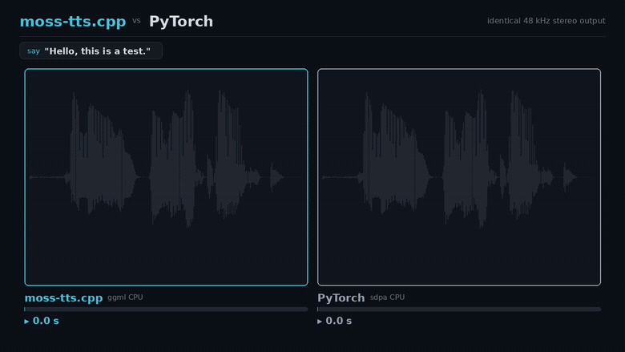
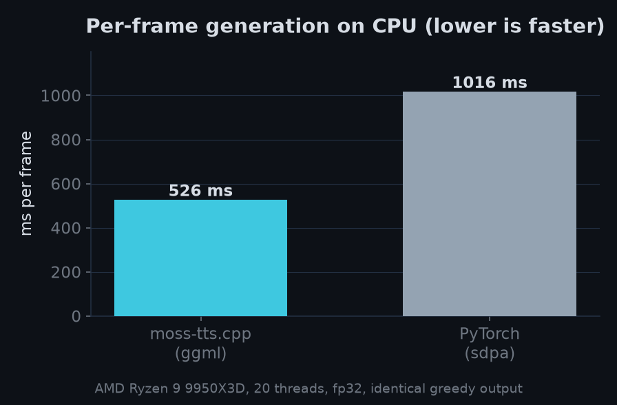
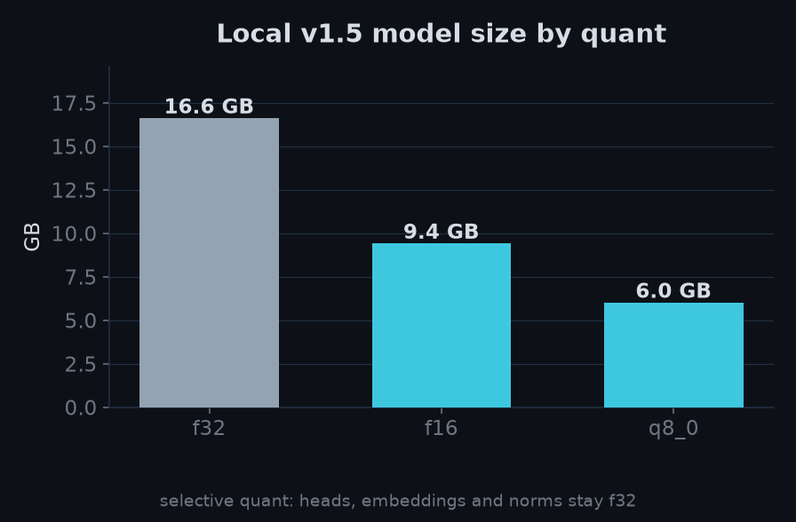
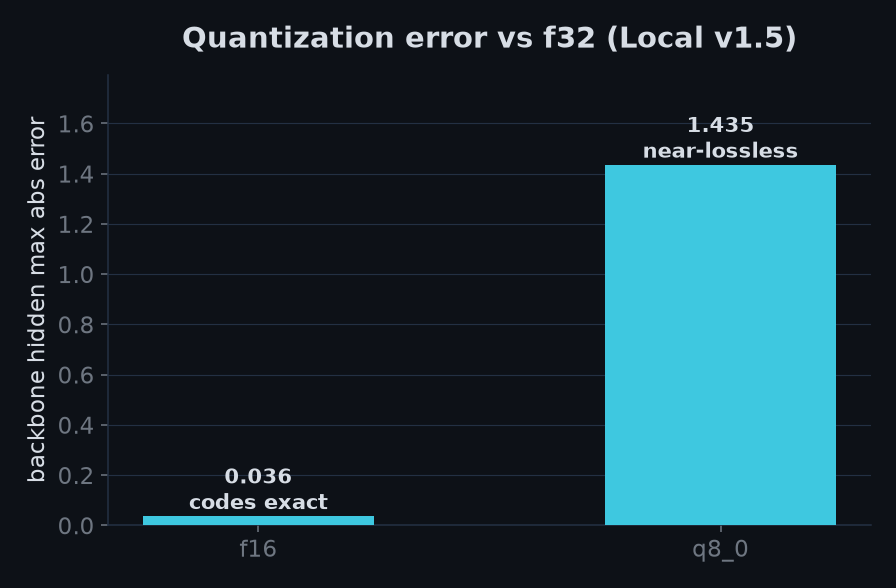
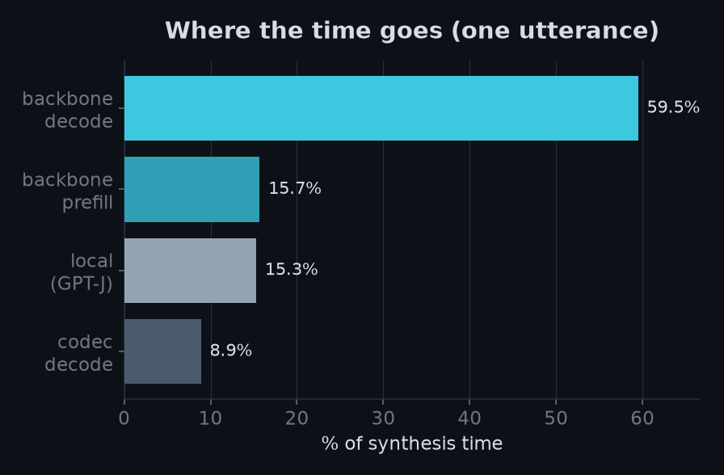

# moss-tts.cpp

**Brought to you by the [LocalAI](https://github.com/mudler/LocalAI) team**, the folks behind LocalAI, the open-source AI engine that runs any model (LLMs, vision, voice, image, video) on any hardware, no GPU required.

[](https://huggingface.co/mudler/MOSS-TTS-Local-Transformer-v1.5-GGUF)
[](LICENSE)
[](https://github.com/mudler/LocalAI)

moss-tts.cpp is a from-scratch C++17 inference port of the OpenMOSS [MOSS-TTS](https://huggingface.co/OpenMOSS-Team) text-to-speech family, built on [ggml](https://github.com/ggml-org/ggml). It runs the whole family (the Delay, Local, Realtime, and Nano generative models plus the shared MOSS-Audio-Tokenizer neural codec) on CPU or any ggml GPU backend, from a single self-contained GGUF, with **no Python, PyTorch, ONNX, or CUDA toolkit at inference time**. The port is numerically verified against the reference PyTorch implementation, and on CPU it is about **2x faster per frame than PyTorch at the same precision**.



> The same prompt, side by side: identical greedy codes, moss-tts.cpp gets there first ([full clip](benchmarks/media/moss_tts_race.mp4)).

You get text-to-speech (with optional voice cloning from a reference clip), audio-codec encode/decode/reconstruct, a small CLI, and a flat C-API (`include/moss_tts_capi.h`) that loads via `dlopen`/FFI from C, C++, Go, or Rust.

---

## Supported models

Every variant of the OpenMOSS MOSS-TTS family is implemented here and gated for numerical parity against the reference. The **Local v1.5** model and the **MOSS-Audio-Tokenizer-v2** codec are verified end to end on the real weights and published as GGUF; the others are implemented and validated component by component.

| Model | CLI | Rate | Codebooks | Status | Source |
| ----- | --- | ---- | --------- | ------ | ------ |
| [MOSS-TTS-Local-Transformer-v1.5](https://huggingface.co/OpenMOSS-Team/MOSS-TTS-Local-Transformer-v1.5) (Local) | `tts-local` | 48 kHz stereo | 12 | real-model verified, GGUF published | OpenMOSS |
| [MOSS-TTS-Local-Transformer](https://huggingface.co/OpenMOSS-Team/MOSS-TTS-Local-Transformer) (Delay) | `tts` | 24 kHz | 32 | implemented, parity-gated | OpenMOSS |
| MOSS-TTS-Realtime (Realtime) | `tts-rt` | 24 kHz | 16 | implemented, parity-gated | OpenMOSS |
| [MOSS-TTS-Nano](https://huggingface.co/OpenMOSS-Team) (Nano) | `tts-nano` | 48 kHz stereo, streaming | 32 | implemented, parity-gated | OpenMOSS |
| [MOSS-Audio-Tokenizer](https://huggingface.co/OpenMOSS-Team/MOSS-Audio-Tokenizer) / [-v2](https://huggingface.co/OpenMOSS-Team/MOSS-Audio-Tokenizer-v2) (codec) | `encode` / `decode` / `reconstruct` | 24 / 48 kHz | 32 | v2 decode verified (115 dB SNR) | OpenMOSS |

GGUFs for the Local v1.5 model (plus its codec and tokenizer) live at [mudler/MOSS-TTS-Local-Transformer-v1.5-GGUF](https://huggingface.co/mudler/MOSS-TTS-Local-Transformer-v1.5-GGUF). Convert any variant yourself with the `scripts/convert_*` converters (safetensors to GGUF, no torch needed).

---

## Performance

On CPU, moss-tts.cpp runs the Local v1.5 model about **1.9x faster per generated frame than the reference PyTorch runtime** at the same f32 precision, with the same greedy output. Measured on an AMD Ryzen 9 9950X3D (20 threads), both engines fp32, same 66-token prompt, matched frame count:

| Engine | Per-frame generation (backbone + local) |
| ------ | --------------------------------------- |
| moss-tts.cpp (ggml) | about 526 ms (about 435 ms steady state) |
| PyTorch (sdpa, CPU) | about 1016 ms |

The dominant cost is the global backbone forward (about 60%); the GPT-J local depth loop (about 15%) and the codec decode (about 9%) are cheap. Quantization widens the gap and shrinks the model: f16 is code-exact versus f32, q8_0 is near-lossless at roughly a third the size.

| Quant | Size | Quality |
| ----- | ---- | ------- |
| f16   | 9.4 GB | code-exact vs f32 |
| q8_0  | 6.0 GB | near-lossless |

<p align="center">
  
  
</p>
<p align="center">
  
  
</p>

### See it run

The same prompt fed to moss-tts.cpp and to the OpenMOSS PyTorch runtime on the same CPU. The greedy codes come out identical, moss-tts.cpp just gets there first (slowed down so the race is watchable): [moss-tts.cpp vs PyTorch on CPU](benchmarks/media/moss_tts_race.mp4).

---

## Verification and parity

The port is verified per component against the reference PyTorch model, not by end-to-end listening. For the Local v1.5 model on the real weights:

- **Language model:** the global Qwen3 backbone hidden state matches to about `4.6e-05`, the binary decision head to about `9e-06`, and all 12 GPT-J audio heads to about `7e-05`, with the greedy 13-code sequence **exact**.
- **Codec (MOSS-Audio-Tokenizer-v2 decode):** the interleaved 48 kHz stereo waveform matches the reference at **114.9 dB SNR** (max abs error about `9e-07`, bit-exact in f32) across dequantization, all 12 decoder stages, and the stereo interleave.
- **Prompt:** the tokenized generation prompt matches the reference processor exactly (piece-wise BPE assembly), so the model stops where it should.

The parity gates are env-gated tests (`tests/test_local_v15_parity.cpp`, `tests/test_codec_v2_parity.cpp`, `tests/test_prompt_local_v15_parity.cpp`), each with a torch reference dumper under `scripts/gen_*_reference.py`. Without the real weights they skip, so the suite stays green in CI.

---

## Build

```bash
cmake -B build -DMOSS_TTS_BUILD_TESTS=ON -DMOSS_TTS_BUILD_EXAMPLES=ON -DCMAKE_BUILD_TYPE=Release
cmake --build build -j
```

This builds the static/shared library and the `moss-tts-cli` tool. ggml is vendored under `third_party/ggml`; the CPU backend uses `-march=native` by default. GPU backends (CUDA, Metal, Vulkan, HIP) come from ggml's own CMake options.

---

## Get the models

Grab the published Local v1.5 GGUFs (model + codec + tokenizer):

```bash
hf download mudler/MOSS-TTS-Local-Transformer-v1.5-GGUF --local-dir models
```

Or convert any upstream checkpoint yourself (the converters read safetensors with numpy, no torch at convert time):

```bash
# Local v1.5 (auto-detects the GPT-J arm from the config; bf16 ok)
python scripts/convert_moss_tts_local_to_gguf.py \
    --model OpenMOSS-Team/MOSS-TTS-Local-Transformer-v1.5 \
    --out models/moss-tts-local-v1_5-f32.gguf --strict
# the v2 codec + the tokenizer
python scripts/convert_audio_tokenizer_nano_to_gguf.py \
    --model OpenMOSS-Team/MOSS-Audio-Tokenizer-v2 \
    --out models/moss-audio-tokenizer-v2-f32.gguf --strict
python scripts/convert_tokenizer.py \
    --src OpenMOSS-Team/MOSS-TTS-Local-Transformer-v1.5 \
    --out models/moss-tokenizer-v1_5.gguf
# quantize (selective: heads/embeds/norms stay f32, only the matmuls quantize)
python scripts/quantize_gguf.py --src models/moss-tts-local-v1_5-f32.gguf \
    --out models/moss-tts-local-v1_5-q8_0.gguf --type q8_0
```

`AGENTS.md` has the full per-variant convert-and-verify runbook.

---

## Running inference

Text to speech with the Local v1.5 model (48 kHz stereo output):

```bash
moss-tts-cli tts-local \
    --model models/moss-tts-local-v1_5-q8_0.gguf \
    --codec models/moss-audio-tokenizer-v2-f32.gguf \
    --tokenizer models/moss-tokenizer-v1_5.gguf \
    --text "Hello from the LocalAI team." \
    --out out.wav

# voice cloning: continue a speaker from a reference clip
moss-tts-cli tts-local ... --reference speaker.wav --text "..." --out out.wav
```

The other variants follow the same shape: `tts` (Delay, 24 kHz), `tts-rt` (Realtime), `tts-nano` (Nano, 48 kHz stereo, with `--stream`). The codec alone does `encode` (wav to codes), `decode` (codes to wav), and `reconstruct` (round-trip), and `info` prints a model's metadata. Run `moss-tts-cli` with no arguments for the full usage.

---

## Library and C-API

The engine is a static/shared library behind a flat C ABI (`include/moss_tts_capi.h`): opaque handles, `load`/`free`, the synthesis and codec calls, `free_string`, `last_error`, and `abi_version`. No C++ types cross the boundary, so it is straightforward to `dlopen` from Go, Rust, or C. A C++ header (`include/moss_tts.h`) exposes `moss::Codec` directly. Build a shared library with `-DMOSS_TTS_SHARED=ON`.

---

## Use it from LocalAI

moss-tts.cpp is built to drop into [LocalAI](https://github.com/mudler/LocalAI) as a backend: the shared library is loaded via purego (cgo-less `dlopen`) and exposed through an OpenAI-compatible text-to-speech endpoint, so you can call it with the same API you use for every other model in LocalAI.

---

## Why moss-tts.cpp

Running MOSS-TTS just for inference otherwise drags in a heavy Python and PyTorch stack. moss-tts.cpp is a from-scratch C++17/ggml port focused purely on inference:

- **No Python at inference.** A single library behind a flat C-API, easy to embed.
- **Faster than PyTorch on CPU** (see [Performance](#performance)), with numerically verified output.
- **Small and portable.** Self-contained GGUF with f16 and q8_0 variants, on CPU or any ggml GPU backend.
- **Whole family, parity-first.** Delay, Local, Realtime, Nano, and the shared codec, each gated against the reference rather than eyeballed.

---

## Citation

If you use moss-tts.cpp, please cite this repository and the original models:

```bibtex
@software{moss_tts_cpp,
  title  = {moss-tts.cpp: a C++/ggml inference engine for OpenMOSS MOSS-TTS},
  author = {Di Giacinto, Ettore},
  url    = {https://github.com/mudler/moss-tts.cpp},
  year   = {2026}
}
```

The MOSS-TTS models and the MOSS-Audio-Tokenizer are by the [OpenMOSS team](https://huggingface.co/OpenMOSS-Team).

## Author

Ettore Di Giacinto ([@mudler](https://github.com/mudler)).

## License

moss-tts.cpp is released under the [MIT License](LICENSE). The model weights are governed by their original OpenMOSS licenses, so check each model card on HuggingFace. AI-assisted contributions follow the policy in [`AGENTS.md`](AGENTS.md).

---

Built by the [LocalAI](https://github.com/mudler/LocalAI) team. If you want to run text-to-speech (and LLMs, vision, voice, image, and video models) locally on any hardware with an OpenAI-compatible API, [give LocalAI a star](https://github.com/mudler/LocalAI).
